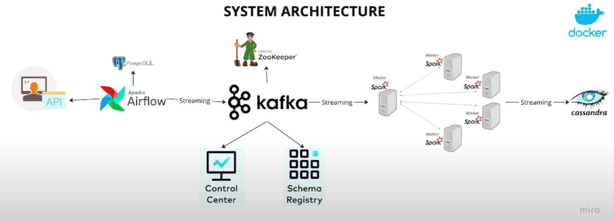
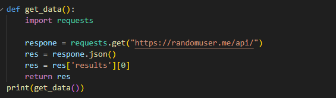
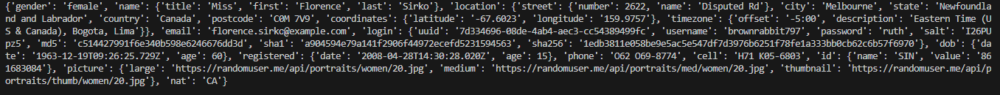
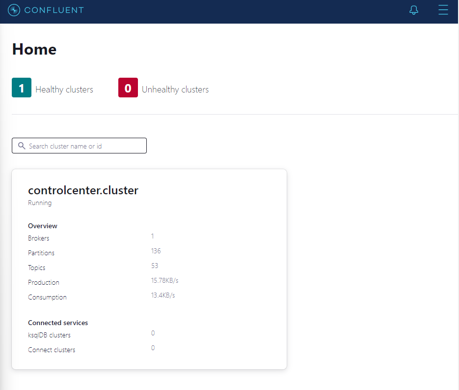
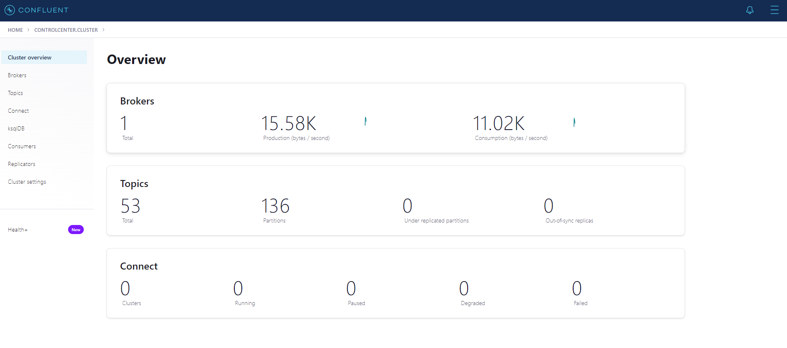
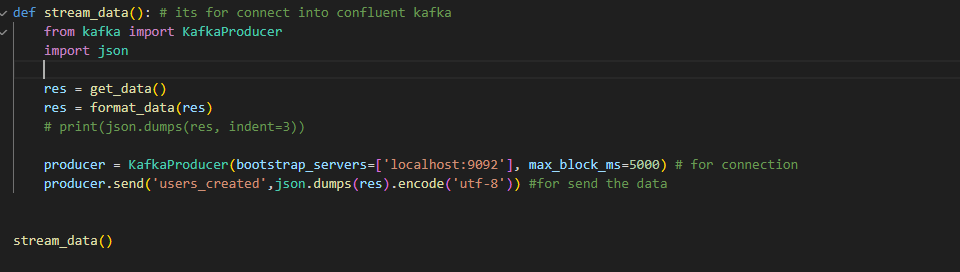

# Realtime-data-streaming

This Project On Development

This project will be building a real-time data streaming pipeline, covering each phase from data ingestion to processing and finally storage. It will utilize a powerful stack of tools and technologies, including Apache Airflow, Python, Apache Kafka, Apache Zookeeper, Apache Spark, and Cassandra—all neatly containerized using Docker.

# Hands-on

first we need to make sure the code for get data from API work properly.

We need to build docker-compose.yaml and containerized the all tools we need based on architecture. You can se here.

Next Run it, if all container already healthy you can olen localhost:9021. 

Now if we see the topic part, its still empty, so we need to go back into kafka_stream.py to make it work and connected into our broker. After make connection we need to make sure it like this picture: 

